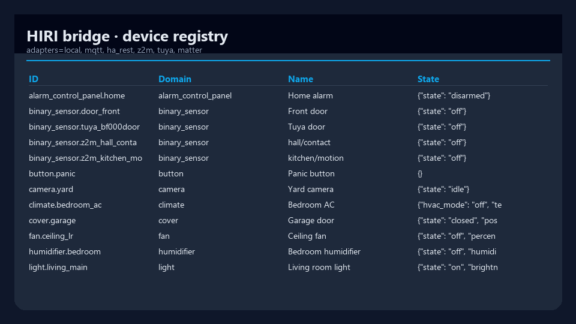
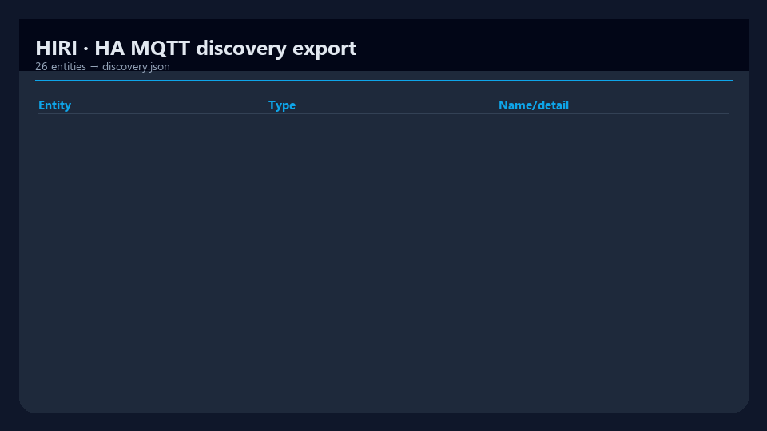

# HIRI

[](https://www.python.org/downloads/)
[](packages/bridge/pyproject.toml)
[](LICENSE)
[](https://www.home-assistant.io/)
[](https://github.com/mergeos-bounties)

**HIRI** is a smart-home **bridge + firmware** stack for **Home Assistant** and multi-ecosystem device adapters — local registry, MQTT discovery, REST API, ESP firmware, and client scaffolds.

**Product:** [mergeos-bounties/HIRI](https://github.com/mergeos-bounties/HIRI)

---

## Table of contents

- [Monorepo packages](#monorepo-packages)
- [Highlights](#highlights)
- [Screenshots](#screenshots)
- [Quick start (bridge)](#quick-start-bridge)
- [CLI reference](#cli-reference)
- [Adapters](#adapters)
- [Diagrams](#diagrams)
- [Architecture](#architecture)
- [Safety](#safety)
- [Development](#development)
- [MergeOS bounties](#mergeos-bounties)
- [License](#license)

---

## Monorepo packages

| Package | Path | Role |
| --- | --- | --- |
| **HIRI-bridge** | `packages/bridge` | Device registry, adapters, HA MQTT discovery, FastAPI |
| **HIRI-firmware** | `packages/firmware` | ESP32 / ESP8266 firmware (PlatformIO) → MQTT → HA |
| **HIRI-web** | `packages/web` | User dashboard |
| **HIRI-admin** | `packages/admin` | Admin console (devices, adapters, logs) |
| **HIRI-android** / **ios** | `packages/…` | Mobile client scaffolds |

Primary offline path: **bridge** (`hiri-bridge demo`).

---

## Highlights

| Capability | Description |
| --- | --- |
| **Device registry** | Seed + import devices; domains (light, fan, sensor, …) |
| **HA discovery** | Export MQTT discovery payloads offline |
| **Adapters** | local, z2m, tuya, ha_rest, mqtt, matter (scaffold) |
| **MQTT dry-run** | Publish discovery without a live broker |
| **Command demo** | Apply sample commands (brightness, effects, fan presets, climate thermostat presets, cover tilt, select scene modes, number min/max clamping, media_player source list, alarm arm modes) in-memory |

---

## Screenshots

| Device registry | HA discovery export |
| :---: | :---: |
|  |  |
| *Live registry after demo seed/import* | *discovery.json entities* |

---

## Quick start (bridge)

```powershell
cd packages\bridge
python -m venv .venv
.\.venv\Scripts\activate
pip install -e ".[dev,api]"

hiri-bridge version
hiri-bridge demo
hiri-bridge devices list
hiri-bridge adapters list
```

Demo writes HA discovery JSON under the bridge `OUT_DIR` (e.g. `discovery.json`).

---

## CLI reference

| Command | Purpose |
| --- | --- |
| `hiri-bridge version` | Version + domains |
| `hiri-bridge demo` | Seed registry, adapters, MQTT dry-run, export discovery |
| `hiri-bridge devices list [-d domain]` | List devices |
| `hiri-bridge adapters list` | Adapter catalog |
| `hiri-bridge ha …` | Home Assistant helpers |
| `hiri-bridge mqtt …` | MQTT discovery publish |
| `hiri-bridge serve` | FastAPI bridge API |

---

## Adapters

| Adapter | Kind | Notes |
| --- | --- | --- |
| `local` | builtin | In-memory seed devices (default offline) |
| `z2m` | mqtt_http | Zigbee2MQTT import (fixture offline) |
| `tuya` | cloud_local | Mapping stub |
| `ha_rest` | http | HA REST `/api/states` (token for live) |
| `mqtt` | mqtt | Discovery publish (optional paho) |
| `matter` | scaffold | Planned |

---

## Diagrams

System architecture and workflow — full width. Open the HTML files for **dark/light theme** and export (PNG/SVG).

### Architecture

[Open interactive diagram](docs/diagrams/architecture.html)

<p align="center">
  
</p>

### Workflow

[Open interactive diagram](docs/diagrams/workflow.html)

<p align="center">
  
</p>

*Generated with [archify](https://github.com/tt-a1i).*

---

## Architecture

```text
                    ┌─────────────┐
   ESP firmware ───►│  MQTT / LAN │◄─── Zigbee2MQTT / Tuya stubs
                    └──────┬──────┘
                           ▼
                 ┌───────────────────┐
                 │   HIRI-bridge     │
                 │ registry · HA disc│
                 │ REST · adapters   │
                 └─────────┬─────────┘
                           ▼
                 Home Assistant (MQTT discovery)
                           ▲
                 web / admin / mobile clients
```

---

## Safety

- **Never commit** HA long-lived tokens, MQTT passwords, or Wi-Fi credentials.
- Firmware defaults must not embed production secrets.
- Prefer dry-run MQTT in demos and CI.

---

## Development

```powershell
cd packages\bridge
pytest -q
ruff check src tests
hiri-bridge demo
```

---

## MergeOS bounties

Device packs, bridge adapters, firmware, web/admin UX.  
Star + claim → PR **master** → MRG **25–200**. Evidence: discovery JSON snippet, HA entity screenshots, or flash notes.

---

## License

MIT · MergeOS / ThanhTrucSolutions
